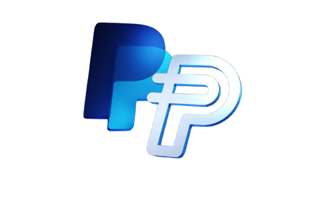

# PYUSD Hub



PYUSD Hub is a comprehensive mobile wallet application for managing PYUSD (PayPal USD) and ETH on the Ethereum network. It combines secure wallet functionality with advanced analytics and network monitoring tools.

Built with Flutter, PYUSD Hub offers a seamless experience for both casual users and crypto enthusiasts, providing intuitive access to the growing PYUSD ecosystem while enabling detailed blockchain insights.

## 📑 Table of Contents
- [Getting Started](#-getting-started)
- [Core Features](#-core-features)
- [Technical Architecture](#-technical-architecture)
- [Advanced Features](#-advanced-features)
- [User Interface](#-user-interface)
- [Testing & Development](#-testing--development)
- [Support & Legal](#-support--legal)

## 🚀 Getting Started

### Prerequisites
- Flutter SDK
- Ethereum node access (Infura, Alchemy, or custom GCP setup)
- Environment configuration

### Installation
1. Clone the repository
```bash
git clone https://github.com/yourusername/pyusd-wallet.git
```

2. Install dependencies
```bash
flutter pub get
```

3. Configure Environment
Create a `.env` file in the project root:
```env
# GCP RPC Endpoints
MAINNET_HTTP_RPC_URL=your_mainnet_http_rpc_url
MAINNET_WSS_RPC_URL=your_mainnet_wss_rpc_url
SEPOLIA_HTTP_RPC_URL=your_sepolia_http_rpc_url
SEPOLIA_WSS_RPC_URL=your_sepolia_wss_rpc_url
PYUSD_CONTRACT_ADDRESS=your_pyusd_contract_address
ETHERSCAN_API_KEY=your_etherscan_api_key
GEMINI_API_KEY=your_gemini_api_key
GCP_SERVICE_ACCOUNT_FILE=path/to/service-account.json
GCP_PROJECT_ID=your_gcp_project_id
NETWORK_CHAIN_ID=your_network_chain_id
```

4. Run the application
```bash
flutter run
```

## 🌟 Core Features

### 🔐 Authentication & Security
- **Secure Wallet Creation**: PIN and biometric authentication
- **Mnemonic Backup**: 12-word recovery phrase generation and storage
- **Import Functionality**: Recovery phrase wallet import
- **Multi-factor Authentication**: Additional security layers
- **Session Management**: Automatic timeout and secure persistence

### 💼 Wallet Management
- **Balance Tracking**: Real-time ETH and PYUSD balances
- **Network Switching**: Mainnet and Sepolia support
- **QR Generation**: Receive funds via QR codes
- **Transaction History**: Complete activity log
- **Address Management**: Easy address sharing

### 💸 Transaction Features
- **Token Transfers**: ETH and PYUSD transfers
- **Gas Optimization**: Dynamic fee estimation (Eco, Standard, Fast)
- **QR Scanning**: Scan recipient addresses
- **Status Monitoring**: Real-time updates
- **Confirmation Management**: Security verification steps


## 🏗 Technical Architecture

### GCP RPC Integration
Our application leverages Google Cloud Platform's RPC endpoints for:
- Transaction Management
- Network Analysis
- Transaction Tracing
- Wallet Management
- Market Insights
- Authentication & Security

### High-Performance Components
1. **Trace Processing Engine**
   - Parallel transaction trace processing
   - Real-time block analysis
   - MEV pattern detection
   - State reconstruction

2. **Analytics Pipeline**
   - Blockchain data stream processing
   - Real-time market analysis
   - Pattern recognition
   - Predictive modeling

3. **Visualization Engine**
   - 3D blockchain state rendering
   - Real-time transaction flows
   - Interactive exploration
   - Optimized performance

## 🔍 Advanced Features

### Blockchain Tracing & MEV Protection
- Detailed transaction execution tracing
- Sandwich attack detection and prevention
- Frontrunning analysis and protection
- Transaction ordering optimization
- MEV activity monitoring

### Analytics & Insights
- Transaction pattern analysis
- Gas usage optimization
- Market price tracking
- Network congestion monitoring
- Interactive data visualization

### PYUSD City Visualization
- Interactive 3D blockchain city
- Real-time transaction vehicles
- Network weather effects
- Interactive building elements
- Congestion visualization

## 📱 User Interface

### Dashboard & Navigation
- Intuitive mobile interface
- Dark/light mode support
- Quick action shortcuts
- Responsive layouts

### Settings & Configuration
- Account management
- Security preferences
- Notification controls
- Network configuration
- Appearance customization

### Notification System
- Transaction alerts
- Gas price notifications
- Security alerts
- Market updates
- Custom alert thresholds

## 🧪 Testing & Development

### Testing Suite
- Unit tests
- Integration tests
- Widget tests
- Mock services

### Developer Integration
- Clean API access
- Documentation
- Example implementations
- Integration guides

## 📞 Support & Legal

### License
This project is licensed under the MIT License - see the LICENSE file for details.

### Contributing
Contributions are welcome! Please check out our contribution guidelines.

### Support
For support, please open an issue in the repository or contact the development team.

### Acknowledgments
- Flutter team
- Ethereum community
- Web3Dart package contributors
- Project contributors
